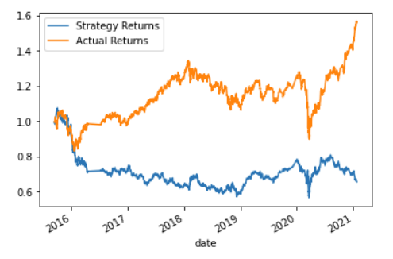

# Algorithmic_Trading
UW Fintech Bootcamp Module 14 Challenge Assignment

---

## Technologies

The following libraries are used in this analysis:  
  
  * pandas  
  * numpy
  * hvplot  
  * matplotlib
  * sklearn / svm
  * sklearn.preprocessing  
  * sklearn.metrics
  * dateoffset
 
---

## Purpose of Program

The main purpose of this project is to develop and optimize a tradinga algorithm that can improve upon the baseline returns.
  
---

## Conclusions

Through this exercise, I looked for ways to improve upon the baseline SVM model with a short 4-day SMA and long 100-day SMA.  The baseline returns were 65%: 
 
 
 
 
I first looked at adjusted the training period from a baseline of 3 months and looked at 1 month and 5 month windows resectively:
  
    
  
    
  
The one month training window resulted in 64% return and the 5 month only changed slightly to 64.2%, both of which were less than the baseline of 65%.  

Next I looked at adjusting the days for the short and long SMA by 25 and 200 days repsectively.  the results are below:  
  
    
  
    
  
    
  
  
  
As the chart shows we have baseline returns of 65%, with a 25 day short SMA that changes to 65.7%, which is not significant, but when we move to 200 days on the long SMA we see significant improvement to 78.2%, and ultimately the best results by combining the 25 days short SMA and 200 day long SMA we see returns improve to 84.9%.
  
  
Finally we looked at using a different model, in this case the decision tree.  
  
     
   
This was our best performing model, earing a 92% return
 
Overall while I was able to find ways to improve upon the baseline, I was unable to match the actual performance of the stock.  

---

## Contributors

The majority of this project has been done independently, with support from my tutor, Katie Kirby.

---

## License

Program is free to use without license.  Only request is that you notify author of use and application.
  
To discuss usage or general inquires please contact the author at jonm5214@gmail.com
